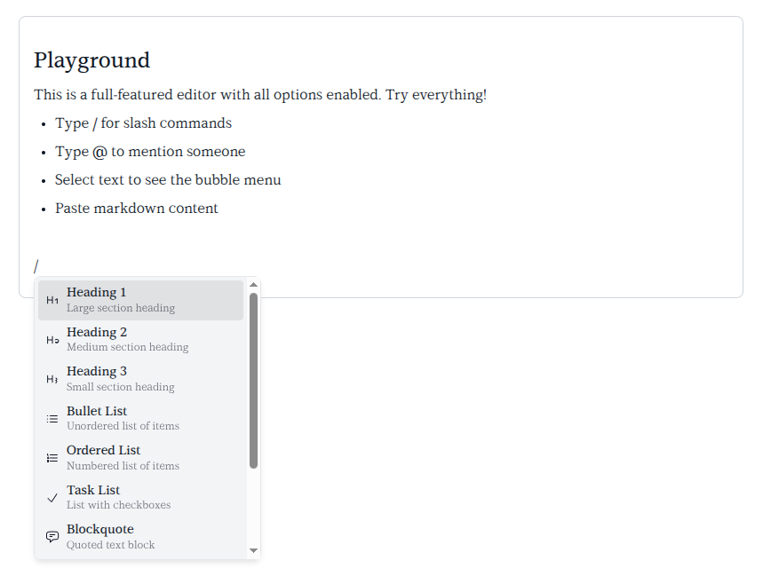

# vue-wysiwyg-tiptap

A headless, extensible WYSIWYG rich-text editor for Vue 3 built on [Tiptap 3](https://tiptap.dev). Ships with slash commands, @mentions, AI text assist, image upload, markdown paste, and a bubble menu — all out of the box.



[Docs & Live Demos](https://jovisai.github.io/vue-wysiwyg-tiptap/) · [npm](https://www.npmjs.com/package/vue-wysiwyg-tiptap) · [GitHub](https://github.com/jovisai/vue-wysiwyg-tiptap)

## Features

- **Slash commands** — type `/` for headings, lists, blockquote, code block, image, horizontal rule
- **Bubble menu** — bold, italic, underline, strikethrough, code, link editing on text selection
- **@mentions** — autocomplete with a configurable member list
- **AI text assist** — modify selected text with customizable AI quick actions
- **Image upload** — file picker, paste, and drag & drop with custom upload handler
- **Markdown paste** — paste markdown and it converts to rich text automatically
- **Task lists** — interactive checkboxes
- **Fully headless** — all styles are optional and overridable via `vwt-*` CSS classes

## Install

```bash
npm install vue-wysiwyg-tiptap vue @tiptap/core @tiptap/vue-3 @tiptap/pm
```

## Quick Start

```vue
<script setup>
import { ref } from 'vue'
import { WysiwygEditor } from 'vue-wysiwyg-tiptap'
import 'vue-wysiwyg-tiptap/styles/editor.css'

const content = ref('<p>Hello world!</p>')
</script>

<template>
  <WysiwygEditor v-model="content" />
</template>
```

## Props

| Prop | Type | Default | Description |
|------|------|---------|-------------|
| `modelValue` | `String` | `''` | v-model HTML content |
| `members` | `Array<{id, label}>` | `[]` | Users for @mention autocomplete |
| `onUploadImage` | `(file: File) => Promise<string \| null>` | `null` | Image upload handler, return URL or null |
| `onImageUploadError` | `(message: string) => void` | `null` | Image upload error callback |
| `onModifyText` | `(html: string, instruction: string) => Promise<string>` | `null` | AI text modification handler |
| `aiQuickActions` | `Array<{label, instruction}>` | See below | Override AI quick action buttons |
| `placeholder` | `String` | `"Type '/' for commands..."` | Editor placeholder text |
| `extensions` | `Array` | `[]` | Additional Tiptap extensions |

**Default AI quick actions:** Polish, Professional, Simplify, Expand, Fix Grammar.

## Events

| Event | Payload | Description |
|-------|---------|-------------|
| `update:modelValue` | `(html: string)` | Content changed (used automatically with v-model) |
| `ready` | `(editor: Editor)` | Tiptap editor instance is ready |

## Slots

| Slot | Scope | Description |
|------|-------|-------------|
| `overlay` | `{ isUploading, isProcessing }` | Custom loading overlay |
| `bubble-menu` | `{ editor }` | Replace the default bubble menu |

## Exposed Refs

Access via a template ref on `<WysiwygEditor ref="editorRef">`:

- `editorRef.editor` — Tiptap `Editor` instance
- `editorRef.aiAssist` — `{ isProcessing, showPanel, togglePanel, applyModification, ... }`
- `editorRef.imageUpload` — `{ isUploading, openFilePicker, ... }`

## Image Upload

```vue
<script setup>
import { ref } from 'vue'
import { WysiwygEditor } from 'vue-wysiwyg-tiptap'

const content = ref('')

async function handleUpload(file) {
  const form = new FormData()
  form.append('image', file)
  const res = await fetch('/api/upload', { method: 'POST', body: form })
  const { url } = await res.json()
  return url
}
</script>

<template>
  <WysiwygEditor v-model="content" :on-upload-image="handleUpload" />
</template>
```

Images can be inserted via slash command, paste, or drag & drop. Accepted types: JPEG, PNG, GIF, WebP.

## AI Assist

```vue
<script setup>
import { ref } from 'vue'
import { WysiwygEditor } from 'vue-wysiwyg-tiptap'

const content = ref('')

async function handleModify(html, instruction) {
  const res = await fetch('/api/ai/modify', {
    method: 'POST',
    headers: { 'Content-Type': 'application/json' },
    body: JSON.stringify({ html, instruction }),
  })
  const { result } = await res.json()
  return result
}

const actions = [
  { label: 'Summarize', instruction: 'Summarize in one sentence' },
  { label: 'Translate', instruction: 'Translate to French' },
]
</script>

<template>
  <WysiwygEditor
    v-model="content"
    :on-modify-text="handleModify"
    :ai-quick-actions="actions"
  />
</template>
```

## Mentions

```vue
<template>
  <WysiwygEditor
    v-model="content"
    :members="[
      { id: '1', label: 'Alice Johnson' },
      { id: '2', label: 'Bob Smith' },
    ]"
  />
</template>
```

Type `@` to trigger autocomplete. Up to 8 suggestions shown, filtered case-insensitively by label.

## Styles

Two optional stylesheets are provided:

```js
import 'vue-wysiwyg-tiptap/styles/editor.css'       // Editor UI (bubble menu, slash commands, etc.)
import 'vue-wysiwyg-tiptap/styles/rich-content.css'  // Typography for rendered HTML output
```

For rendered output, wrap your content in a `.vwt-rich-content` container:

```html
<div class="vwt-rich-content" v-html="content" />
```

All CSS classes use the `vwt-` prefix and can be freely overridden. See the [Styling guide](https://jovisai.github.io/vue-wysiwyg-tiptap/#/styling) for the full class reference.

## Individual Exports

All components, extensions, composables, and utilities are individually importable:

```js
import { SlashCommand, MentionExtension, ExitBlock, MarkdownPaste } from 'vue-wysiwyg-tiptap'
import { useEditorImageUpload, useEditorAIAssist } from 'vue-wysiwyg-tiptap'
import { isAllowedUrl, createSuggestionRenderer } from 'vue-wysiwyg-tiptap'
```

## License

[MIT](LICENSE)
